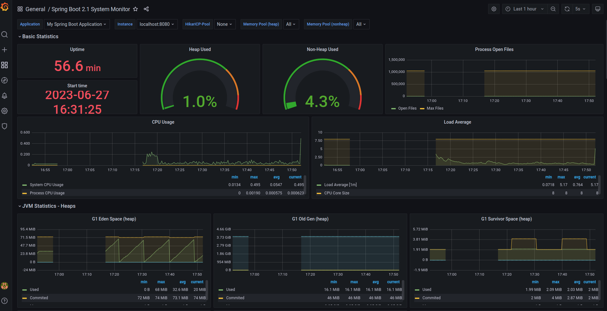

## 1- Importer le projet
Fork le projet  
Cloner le projet sur la machine locale  
Exécuter ./mvnw spring-boot:run  
tester l'url : http://localhost:8080/swagger-ui.html

## 2- Création de pipline
Ajouter une action sur github:

    name: App pipeline  

    on:
    push:
        branches:
        - main
    pull_request:
        branches:
        - main

    jobs:
    build-and-test:
        runs-on: ubuntu-latest

        steps:
        - uses: actions/checkout@v3

        - name: Set up JDK 17
            uses: actions/setup-java@v2
            with:
            java-version: '17'
            distribution: 'adopt'

        - name: Build
            run: mvn clean install --no-transfer-progress -Dmaven.test.skip=true

        - name: Tests
            run: mvn test --no-transfer-progress

Corriger l'erreur sur le code

## 3 - Ajouter une étape de qualité du code
Créer un compte sur sonarsource hub : https://www.sonarsource.com/products/sonarcloud/signup/

Créer un projet 
renommer la branche master en main sur sonarsource 
Ajouter la configuration proposée aux actions github

Corriger les erreurs "Remove this unused import" remonter par sonarsource
Verifier le covrege de votre projet

Ajouter la section suivante au fichier pom: 

	<profiles>
	   <profile>
  	   <id>coverage</id>
  	   <build>
	   <plugins>
	    <plugin>
	      <groupId>org.jacoco</groupId>
	     <artifactId>jacoco-maven-plugin</artifactId>
	      <version>0.8.7</version>
	      <executions>
		<execution>
		  <id>prepare-agent</id>
		  <goals>
		    <goal>prepare-agent</goal>
		  </goals>
		</execution>
		<execution>
		  <id>report</id>
		  <goals>
		    <goal>report</goal>
		  </goals>
		  <configuration>
		    <formats>
		      <format>XML</format>
		    </formats>
		  </configuration>
		</execution>
	      </executions>
	    </plugin>
	   </plugins>
	  </build>
	</profile>
    </profiles>

Ajouter "-Pcoverage" a configuratuon sonar de votre pipline

## 4 - Ajouter une étape création d'image docker

Ajouter un fichier "Dockerfile"

    FROM eclipse-temurin:17-jdk-alpine
    VOLUME /tmp
    ARG JAR_FILE
    COPY ${JAR_FILE} app.jar
    ENTRYPOINT ["java","-jar","/app.jar"]

Créer un compte sur docker hub : https://hub.docker.com/  

Ajouter les secrets suivants sur github:  
    -DOCKER_HUB_USERNAME  
    -DOCKER_HUB_PASSWORD    

Ajouter la section suivante sur github actions:

    - name: Publish to Docker Hub
      uses: docker/build-push-action@v1     
      with:       
       username: ${{ secrets.DOCKER_HUB_USERNAME }} 
       password:  ${{ secrets.DOCKER_HUB_PASSWORD }}
       repository: yourusername/yourprojectname       
       tags: ${{github.run_number}}
 ## 5 - Test votre image docker
 	docker run -p 8086:8080 yourusername/yourprojectname:tag

 ## 6 - Ajouter les dépendances de prometheus
    <dependency>
      <groupId>io.micrometer</groupId>
      <artifactId>micrometer-registry-prometheus</artifactId>
      <scope>runtime</scope>
    </dependency>
    <dependency>
        <groupId>org.springframework.boot</groupId>
        <artifactId>spring-boot-starter-actuator</artifactId>
    </dependency>

puller la dernière version de docker et tester l'endpoint prometheus : 

    http://localhost:8086/actuator/prometheus

## 7 - Ajouter un fichier docker-compose.yml

    version: '3'
    services:
    prometheus:
        image: prom/prometheus:v2.35.0
        network_mode: host
        container_name: prometheus
        restart: unless-stopped
        volumes:
        - ./prometheus:/etc/prometheus/
        command:
        - "--config.file=/etc/prometheus/prometheus.yaml"

 
ajouter le fichier prometheus.yaml au dossier ./prometheus/prometheus.yaml :

    scrape_configs:
    - job_name: 'Spring Boot Application input'
        metrics_path: '/actuator/prometheus'
        scrape_interval: 2s
        static_configs:
        - targets: ['localhost:8086']
            labels:
            application: 'My Spring Boot Application'

Démarrer docker compose:

    docker-compose up

Tester le serveur prometheus:

    http://localhost:9090/

## 8 - Ajouter au fichier docker-compose.yml la congig grafana
    grafana:
        image: grafana/grafana-oss:8.5.2
        network_mode: host
        container_name: grafana
        restart: unless-stopped
        user: root
        volumes:
        - ./data/grafana:/var/lib/grafana
        environment:
        - GF_SECURITY_ADMIN_PASSWORD=admin
        - GF_USERS_ALLOW_SIGN_UP=false
        - GF_SERVER_DOMAIN=localhost
        # Enabled for logging
        - GF_LOG_MODE=console file
        - GF_LOG_FILTERS=alerting.notifier.slack:debug alertmanager:debug ngalert:debug

Restrer docker-compose :

    docker-compose down
    docker-compose up

Tester le serveur grafana:

    http://localhost:3000/

## 9 - Ajouter la datasource de prometheus sur grafana

Sur l'interface de grafana, choisissez la Configuration > datasource et sélectionnez Prometheus

ajouter l'url du serveur Prometheus

    http://localhost:9090/

Sauvegarder la configuration

## 9 - Ajouter le dastbord springboot

Sur l'interface de grafana, choisissez la Create > import et ajoutez le code suivant pour le dashboard suivante:

    https://grafana.com/grafana/dashboards/6756-spring-boot-statistics/

## 10 - Test le dastbord

